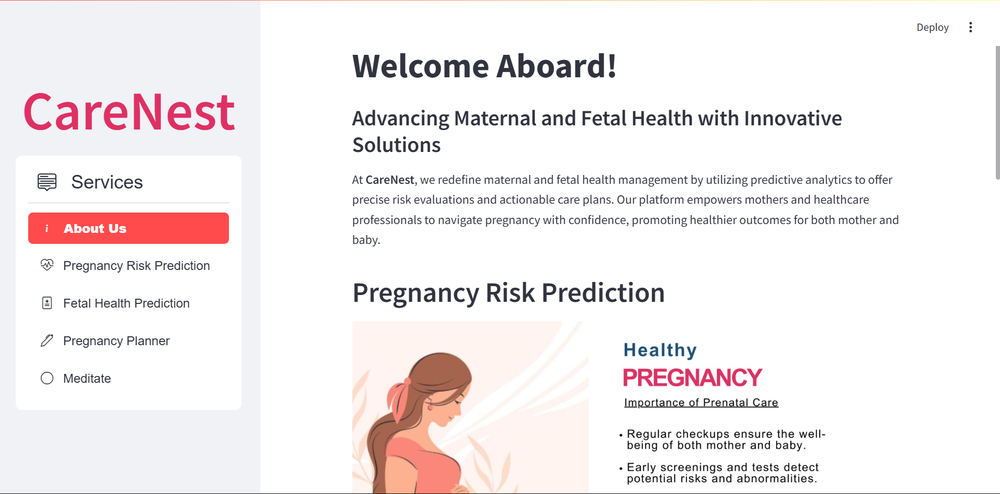
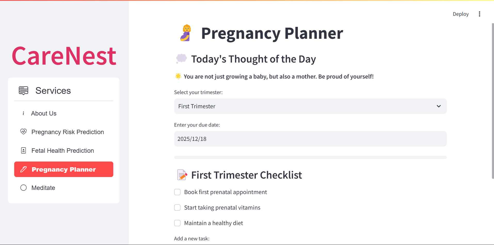
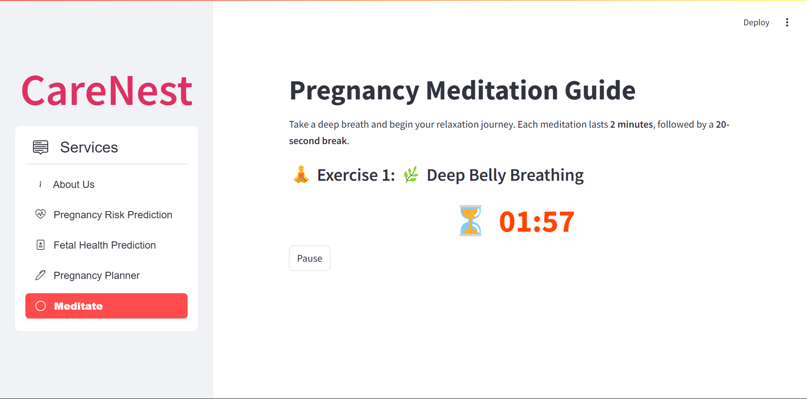

# CareNest – AI-Powered Maternal and Fetal Health Platform  

CareNest is an AI-driven healthcare platform designed to support maternal and fetal health. It leverages predictive analytics and advanced machine learning models to assess pregnancy risks, fetal health, and provide personalized care planning.  

---

## 🚀 Features  

### 🔹 Pregnancy Risk Prediction  
### 🔹 Fetal Health Prediction  
### 🔹 Pregnancy Planner  
### 🔹 Meditation & Wellness  

---

## 🛠 Tech Stack  

- **Frontend:** [Streamlit](https://streamlit.io/)  
- **Backend:** Python, Pickle, HTML    
- **Machine Learning Models:**
  
  - Pregnancy Risk Prediction Model (`finalized_maternal_model.sav`)  
  - Fetal Health Classifier (`fetal_health_classifier.sav`)  
- **Data Visualization:** Plotly, Pandas  
- **Web Scraping & APIs:** Requests  

---

## 📸 Screenshots  

### 🏠 Home Page  
  

### 💖 Pregnancy Planner  
  

### 🧘‍♀️ Meditation
  

---

## 🎯 Usage Guide
### Pregnancy Risk Prediction
- 1️⃣ Enter your age, BP, sugar levels, temperature, and heart rate.
- 2️⃣ Click Predict Pregnancy Risk.
- 3️⃣ Get an instant AI-based risk assessment.

### Fetal Health Prediction
- 1️⃣ Input fetal health parameters.
- 2️⃣ Click Predict Fetal Health.
- 3️⃣ See if the fetal condition is Normal, Suspect, or Pathological.

### Pregnancy Planner
📌 Set trimester-wise appointments & add your own To-Do list.

### Meditation Mode
🌿 Start a guided meditation with pause & resume features.

